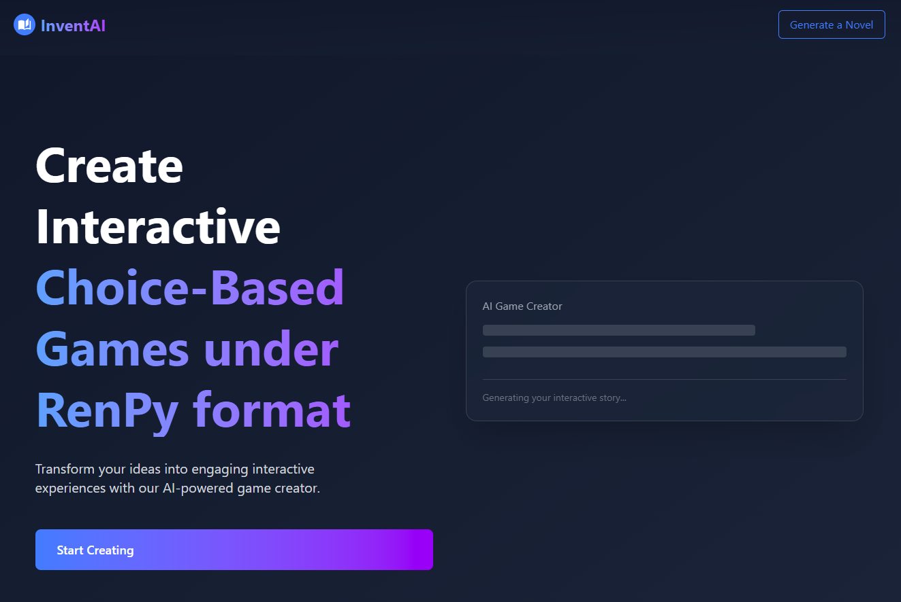

# InventAI Novelcraft

InventAI Novelcraft is a web-based application for generating interactive Ren'Py games using AI. It provides tools for novel generation, character management, discussion context, and more, enabling creators to quickly build rich, branching stories and export them for use in Ren'Py or other engines.

## Installation
To install and run the InventAI NovelCraft application, follow the installation guide in the [INSTALL.md](./docs/INSTALL.md) file.

## Usage
For detailed instructions on how to use the application, including novel generation, character management, and other features, refer to the [USAGE.md](./docs/USAGE.md) file.

## Documentation

For detailed information on installation, usage instructions, examples, and
more, please refer to the complete [documentation](https://inventai-docs.vercel.app/docs/tools/novelcraft).

## Contributing

We welcome contributions from everyone. There are several ways to contribute, and we appreciate all contributions.
See [CONTRIBUTING.md](https://github.com/InventaiSIL/.github/blob/main/profile/CONTRIBUTING.md) file for details.

## License

All code is licensed under the MIT license. See [LICENSE.md](./docs/LICENSE.md) file for details.
