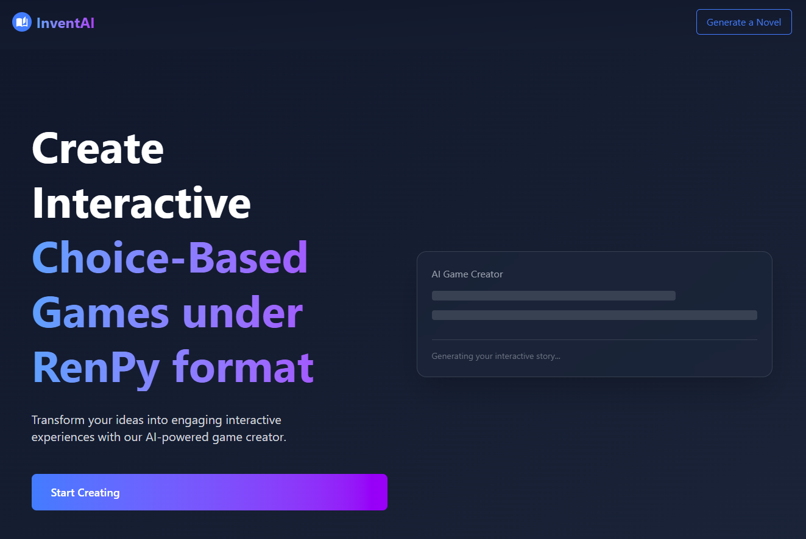
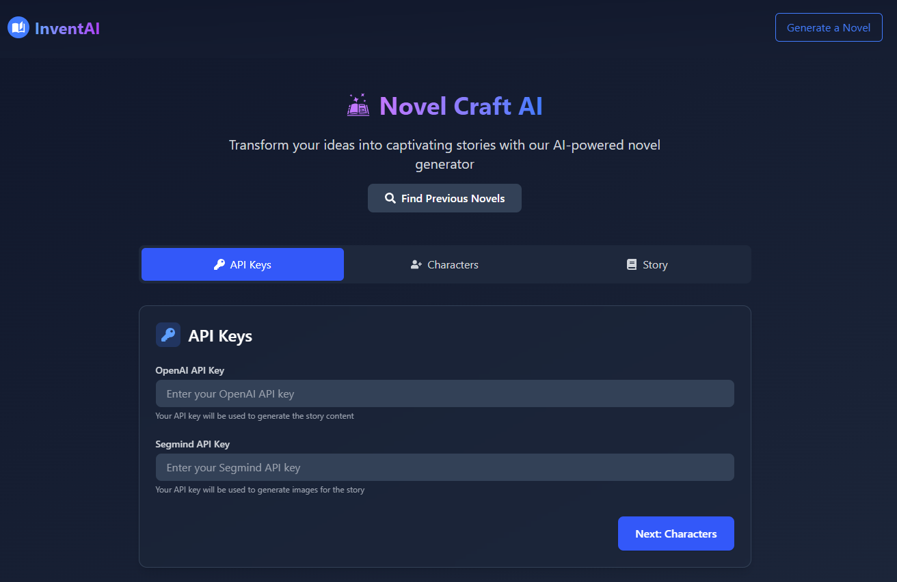
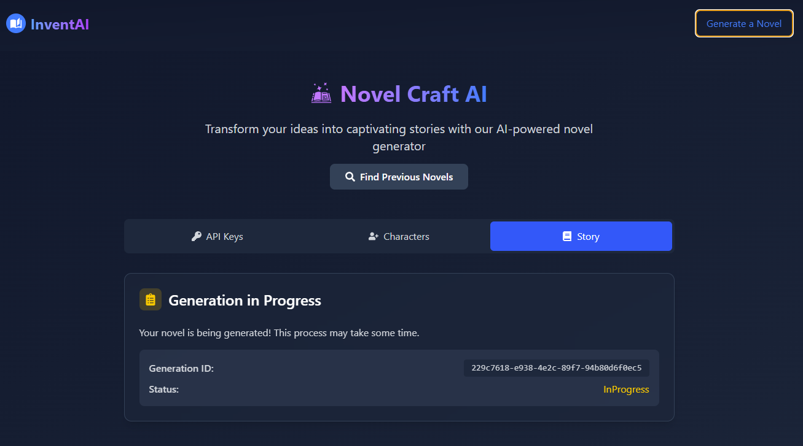
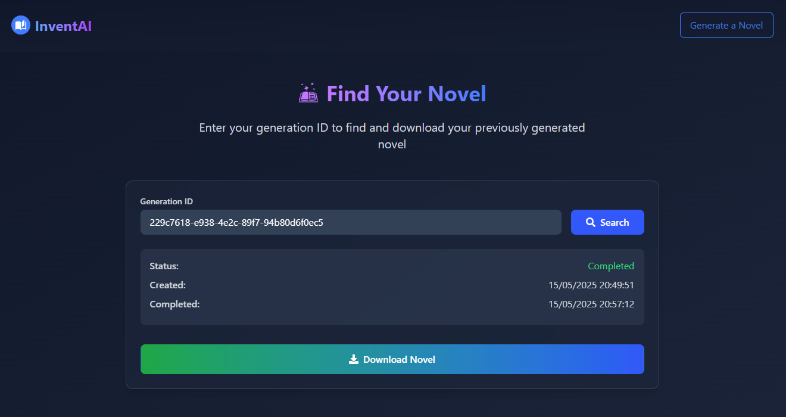
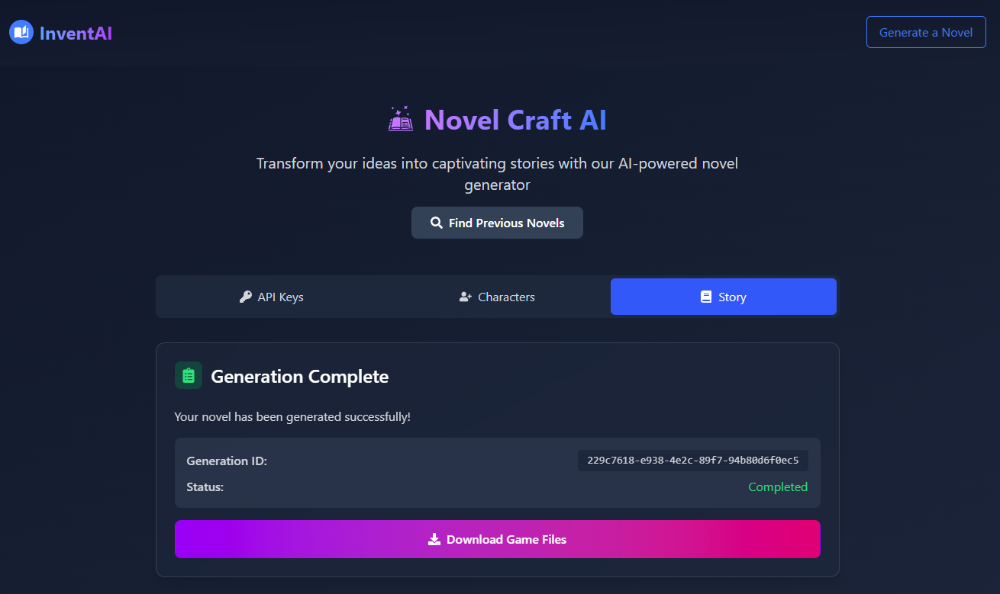

# InventAI NovelCraft Usage Guide

This document provides a comprehensive guide on how to use the InventAI NovelCraft application, including its features and functionalities.

## Launching the Application
To launch the InventAI NovelCraft application, follow the steps in the [Installation Guide](INSTALL.md). Once installed, you can start the server and client as described in the guide.

## Novel Generation
1. **Creating a New Novel**: 
   - Click on the "Generate a Novel" button on the main page 
   - You will be prompted to enter your AI models credentials. Enter your OpenAI API key and Segmind API key for image generation 
   - You can then complete the form with the characters and the story setting.
   - Click on the "Generate" button to start generating your novel 
   - You will be given an identifier for your novel. You can use this identifier to access your novel later 

2. **Viewing Your Novel**:
   - Once the novel is generated, a button will appear on the main page with the identifier of your novel. Click on it to download the novel 
   - The novel will be downloaded as a `.zip` file containing two folders: `novel` and `renpy`. `renpy` contains the Ren'Py game files, and `novel` contains the generated novel files under a custom `InventAI` format.
   - You can view the novel in `Ren'Py` by opening the `renpy` folder in the [Ren'Py launcher](https://www.renpy.org/)